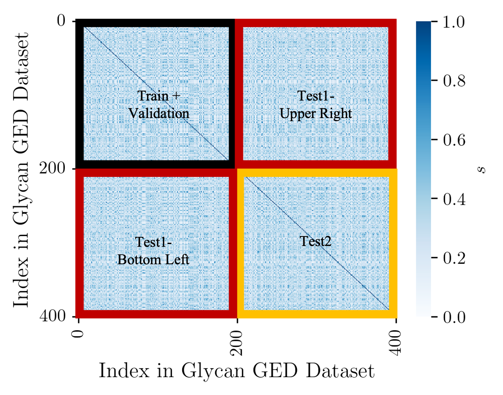

# GED data sets

This work adopts a different data splitting method than the original SimGNN by Bai et al. in order to comprehensively evaluate the prediction ability and generalizability of MacroSimGNN. Based on the distribution of the number of nodes, 200 graphs are randomly selected out of the 400 graphs and reindexed from 1 to 200, with the remaining 200 graphs reindexed from 201 to 400. As shown in above Figure, the black region represents the Training dataset, which comprises graph pairs from the first 200 graphs. This Training dataset is further randomly divided into training (80 %) and validation (20 %) subsets to prevent overfitting (stored in [train_validation_data_set.tar.gz](./train_validation_data_set.tar.gz)). The red region represents the Testing-1 dataset (stored with two parts, [test1_data_set_upper_right.tar.gz](./test1_data_set_upper_right.tar.gz) and [test1_data_set_bottom_left.tar.gz](./test1_data_set_bottom_left.tar.gz)), where one graph in the graph pairs exists in the Training dataset. The orange region represents the Testing-2 dataset (stored in [test2_data_set.tar.gz](./test2_data_set.tar.gz)), where neither graph in the graph pair exists in the Training dataset. The separation of Testing-1 and Testing-2 datasets aims to comprehensively assess MacroSimGNN's prediction ability and generalizability for similarity between unknown graphs. Equal graph pairs are excluded from all datasets because there are more efficient ways to detect equal graph pairs, and including equal graph pairs in the training does not help improve the model’s performance. 

MacroSimGNN is then applied to develop a landmark distance embedding for both unsupervised and supervised learning tasks, using the glycan immunogenicity dataset (stored in [Immunogenic_classification_data_set.tar.gz](./Immunogenic_classification_data_set.tar.gz)) as an example. The glycan immunogenicity dataset comprises 470 non-immunogenic and 549 immunogenic glycans. MacroSimGNN is employed to obtain landmark distance embeddings for all glycans in this immunogenicity dataset. The indices of glycans have been reordered for intuitive visualization: indices 0-469 are non-immunogenic, and indices 470-1018 are immunogenic.